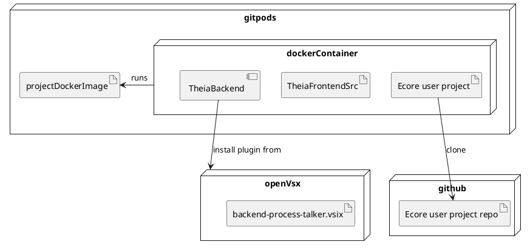
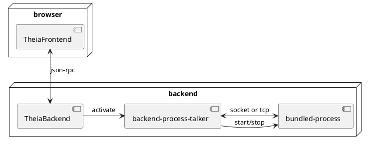
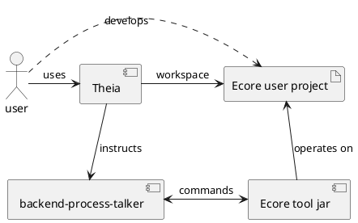

# Design Document

[What is this?](https://www.industrialempathy.com/posts/design-docs-at-google/)

## Context and Scope

Kristian and Hallvard want to know if extensions in VSCode can start and talk to arbitrary background processes. This is because much tooling in MDSE for EMF exists already in the form of java code. Re-using a `.jar` for an extension will simplify the transition of Ecore from EMF in Eclipse into Theia.

This extension is a prototype and will only try to start a bundled `.jar` file and communicate with it.

## Goals and non-goals

* Bundle a `.jar` in an extension.
* Start a process from this `.jar`.
* Communicate bi-directionally from the extension with the process. They run on the same machine.
* Run in Theia, install as an VSCode Extension/Theia Plugin.
* Only use VSCode API. No Theia internal API.

> Non-goal: Things that could be goals, but we chose not to do them.

Non-goals:
* Start a process automatically when a specific file/view is opened.
* Communicate over LSP.

## Design and trade-offs

It will be a VSCode extension project in Typescript.
Using the VSCode extension API you can install the extension during runtime into a Theia instance. This is possibly needed for Gitpods (*assumption*).
A trade-off is that using Theia Extensions, you get full control. Here we are restricted to VSCode API and what subset of it Theia supports.

### System-context-diagram

### Deployment diagram

PlantUML code

### Component diagram

PlantUML code

### Interaction diagram

PlantUML code

### Degree of constraint

The project must work in Theia inside Gitpods.
Gitpods is the ultimate target.

It should be an VSCode extension, but if Gitpods can load Theia Extensions, this constraint falls.

## Alternatives considered

* Using the terminal in Theia to launch a CLI task that starts the `.jar`.
  * An IDE would be better if it did not require users to pollute their project dependencies with its tooling.
* Using a Theia Extension. 
  * This would work, but has the problem that Gitpods deployment might be trickier.
  * Would lose compatibility with VSCode IDE.

